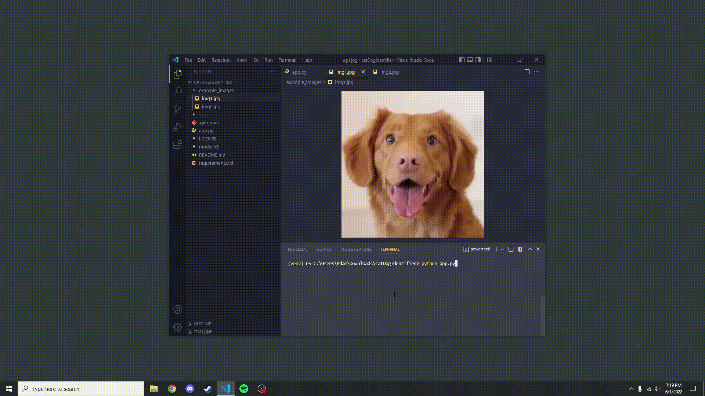

# Cat or dog?
## _Powered by [TensorFlow](https://www.tensorflow.org/)_

This project uses a [convolutional neural network](https://en.wikipedia.org/wiki/Convolutional_neural_network) to identify cats vs dogs with a roughly 85% accuracy. This script imports a model that was trained using the free GPU offered by [Google Colab.](https://research.google.com/colaboratory/)

- [Here](https://www.microsoft.com/en-us/download/confirmation.aspx?id=54765) is the dataset used which contains a total of 25,000 photos of cats and dogs.

## License

MIT

## Contact

Adam#8052 on [Discord](https://discord.com/)
